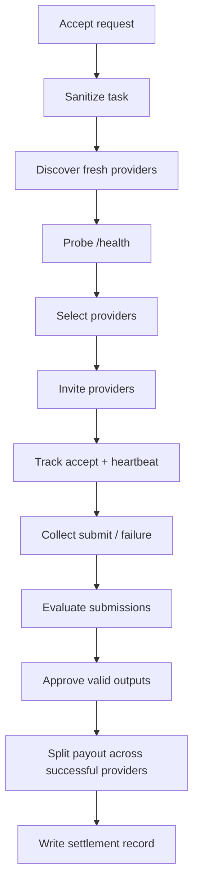

# Raid Lifecycle

Mercenary runs one state machine from request intake to settlement.

## Flow

## Raid Status Values

- `draft`
- `sanitizing`
- `queued`
- `dispatching`
- `running`
- `first_valid`
- `evaluating`
- `settling`
- `final`
- `cancelled`
- `expired`

## Assignment Status Values

- `selected`
- `invited`
- `accepted`
- `running`
- `submitted`
- `invalid`
- `timed_out`
- `failed`
- `disqualified`
- `paid`

## Timeout Defaults

- invite accept: `3000` ms
- first heartbeat: `5000` ms
- heartbeat stale: `8000` ms
- hard execution: `60000` ms
- raid absolute: `90000` ms
- provider freshness: `60000` ms

These map to:

- `BOSSRAID_INVITE_ACCEPT_MS`
- `BOSSRAID_FIRST_HEARTBEAT_MS`
- `BOSSRAID_HEARTBEAT_STALE_MS`
- `BOSSRAID_HARD_EXECUTION_MS`
- `BOSSRAID_RAID_ABSOLUTE_MS`
- `BOSSRAID_PROVIDER_FRESH_MS`

## Failure And Cancellation Rules

- no eligible providers: `409 no_eligible_providers`
- cancelled raids ignore later provider callbacks
- unknown raid ids return `404`
- callbacks without the active `providerRunId` are rejected

## Evaluation Replay

`POST /v1/evaluations/:raidId/replay` re-runs evaluation over stored submissions. It does not re-run provider jobs.

## Next Steps

- [Providers](/docs/platform/providers)
- [Native Raid](/docs/api-reference/native-raid)
- [Persistence And State](/docs/operations/persistence-and-state)
